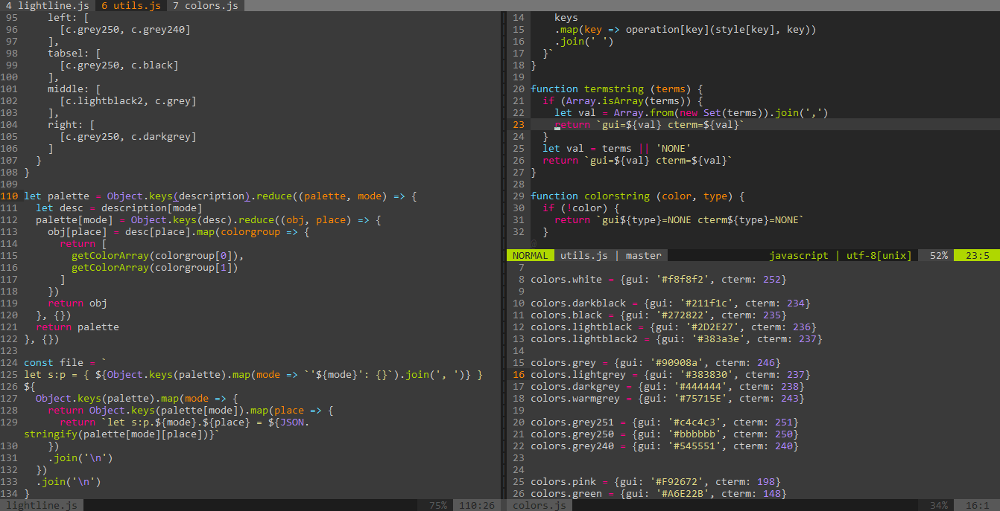

# jojokai

Monokai colorscheme for Vim, [lightline.vim](https://github.com/itchyny/lightline.vim), [vim-buftabline](https://github.com/api/vim-buftabline)

Inspired by [sickill/vim-monokai](https://github.com/sickill/vim-monokai) and [crusoexia/vim-monokai](https://github.com/crusoexia/vim-monokai), their jobs are exellent!

I noticed their colorschemes use some bright colors, and blingbling my doggy eyes after long time coding, so I copy them to change some colors.

the source is written by nodejs, and run `npm run build` to generate codes to vimscript, so the vimscript has no function calling on it, which might a little speed up vim opening (?no testing yet...)

and I use the same color to generate a lightline.vim colorscheme and a buftabline colorscheme to make them cooperate better in vision.
## Usage

Add this colorscheme to .vimrc

```vim
" Vundle
Plugin 'clark-t/jojokai'

" or vim-plug
Plug 'clark-t/jojokai'
```

then set colorscheme to jojokai:

```vim
colorscheme jojokai
```

If you use lightline.vim, then set lightline.vim's colorscheme to
jojokai:

```vim
let g:lightline = { 'colorscheme': 'jojokai' }
```

## Screenshots

Here are some screenshots of jojokai, plugins contains lightline.vim buftabline, and diminactive.

### Normal


### Insert


### Visual


### Works with diminactive

[vim-diminactive](https://github.com/blueeyed/vim-diminactive) is a
exellent plugin to dim the inactive window. Here are two screenshots to
see the performance works with jojokai:


and switch to window 2:



That's all.

kono dio da!

